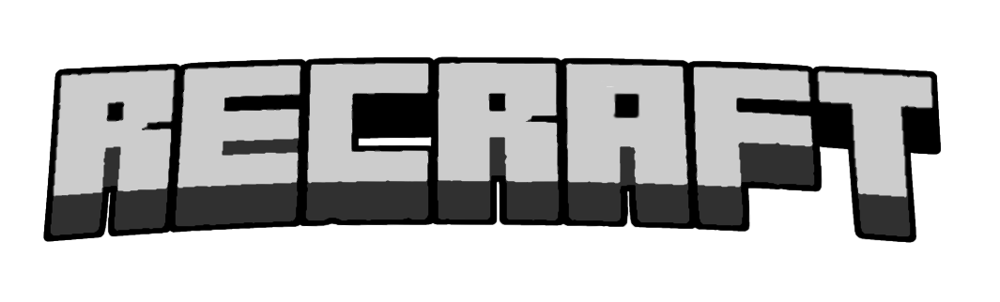

  

<h1 align="center">ReCraft Online</h1>

  
  
  
  

  <strong>A standalone browser-based voxel sandbox game and multiplayer experience</strong>

  <a href="https://crosscraftweb.ddns.net/">Website</a> • 
  <a href="https://github.com/arti-max/ReCraft-Online/issues">Issue Tracker</a> • 
  <a href="LICENSE">License</a>

---

## Overview

ReCraft Online is a lightweight, web-first voxel game recreating the nostalgic atmosphere and mechanics of the early sandbox era (Classic, Survival Test, and Indev). The project runs directly inside modern web browsers with instant loading, no installations, and full multiplayer support.

## Key Highlights

- **Instant Browser Play:** Launch and play directly in any modern desktop browser without downloading third-party launchers or Java runtimes.
- **Classic Survival Experience:** Authentic early survival mechanics, featuring health systems, vintage mob behavior, classic physics, and original combat dynamics.
- **Dedicated Multiplayer:** Real-time online servers enabling players to build, explore, and survive together in shared worlds.
- **Optimized Performance:** Smooth framerates and fast world generation designed specifically for responsive web play.
- **Custom Visuals:** Independent retro-inspired textures, audio, and user interfaces.

## Roadmap & Evolution

- **Classic Era:** Creative sandbox building and classic world sharing.
- **Survival Test:** Hostile mobs, inventory mechanics, and raw survival challenges.
- **Indev Era:** Procedural world themes, expanded crafting, and forgotten early concepts.
- **Modern Web Technologies:** Continued performance enhancements and rendering pipeline updates.

## Disclaimer

ReCraft Online is an independent open-source project and is not affiliated with, endorsed by, or connected to Mojang Studios, Microsoft, or any prior community projects.

## License

This project is licensed under the terms of the [MIT License](LICENSE).